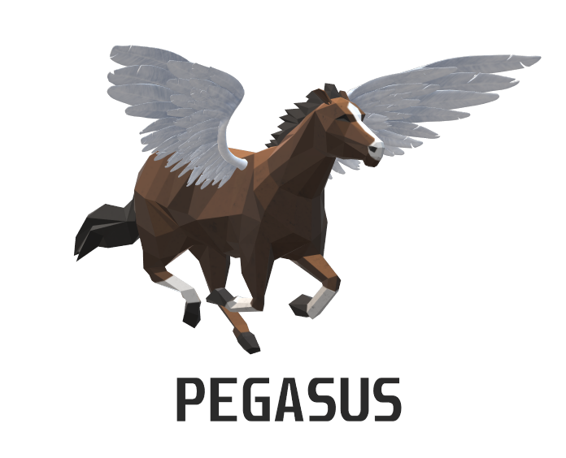
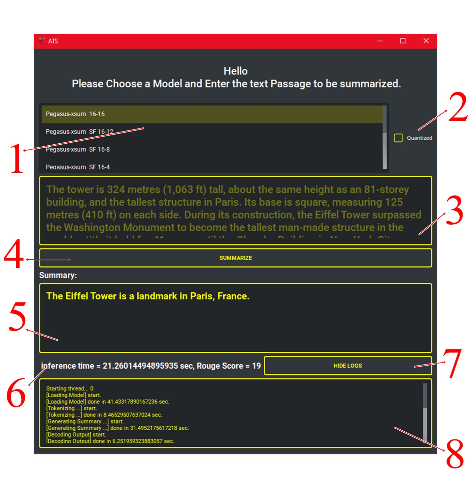

# Automatic Text Summarization GUI Demo




## The GUI 



1. **the List of models to be chosen from**
2. **whether the model should be quantized or not**
3. **an input field to enter the paragraph to be summarized**
4. **press this button to be summarized**
5. **the output summary**
6. **the output inference time and rouge score of the model**
7. **press this button to show or hide the logs** 
8. **the logs field.**


## Requirements

```yml
- python=3.9.4=h6244533_0
- python_abi=3.9=1_cp39
- torch==1.9.0
- datasets==1.9.0
- numpy==1.20.2
- pyside2==5.15.2
- pytest==6.2.3
- pytest-qt==3.3.0
- qt-material==2.8.8
- sentencepiece==0.1.96
- tokenizers==0.10.3
- torch==1.9.0
- transformers==4.8.2

```

